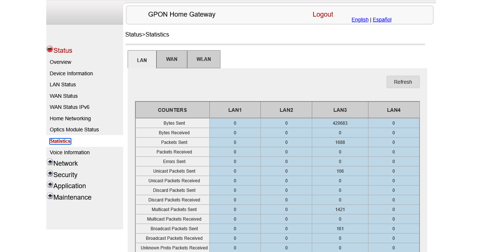

# Network-Stats
Intended to be a collection of tools to analyse network speeds directly from the home router. This means we will have to support a variety of devices.

## Nokia GPON
A sample of the network statistics is shown below

### Approach
- UI-based automation
  Most obvious solution. Slightly complicated and requires state management.
- Requests
  Preferred if we can inspect network requests sent by browser
